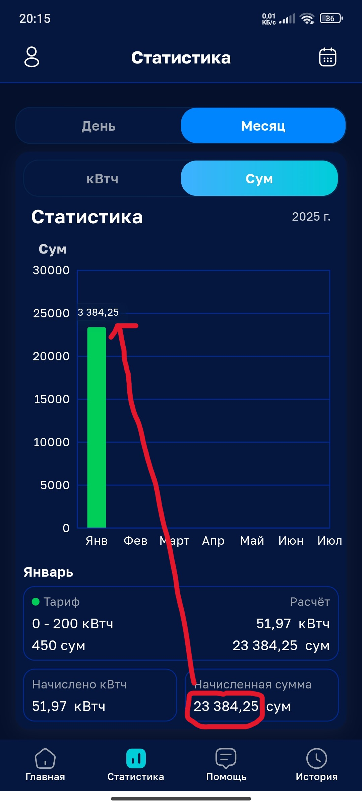

**ID**: HBM-1

---

**Заголовок**: Тултип, показывающий начисленную сумму за месяц, на странице Статистика" - отображается не полностью

---

**Описание**

На странице "Статистика", при отображении начисленных сумм, больше 10_000 сум,
за месяц, тултип месяца Январь, отображается не полностью

**Шаги**:

- Войти в мобильное приложение "HET"
- Перейти на "Статистика"
- Нажать на "Сум"

**Фактический результат**: начисленная сумма не отображает цифры больше 9_999сум

**Ожидаемый результат**: начисленная сумма будет отображается полностью

---

**Приоритет**: Low

---

**Серьезность**: Minor

---

**Вложения**:

